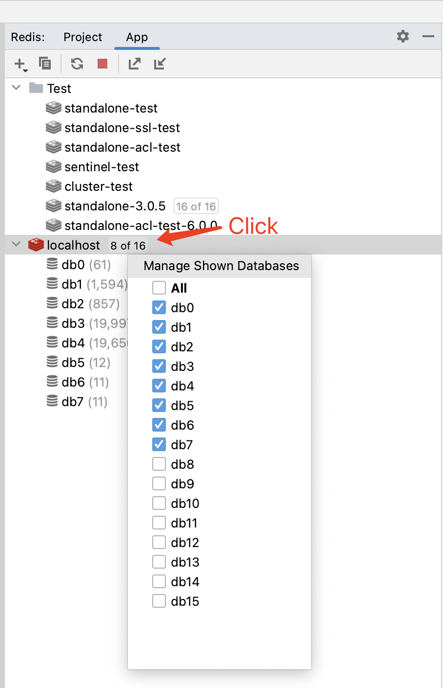

# Redis Operator

A clean and beautiful Redis GUI client.

- Support stand-alone, sentinel and cluster mode
- STRING, LIST, SET, ZSET, HASH and STREAM types
- SSH and SSL
- View value as JSON, XML and HTML, support value codec: BASE64, GZIP, Msgpack, Snappy, BZip2, LZ4, ZSTD, CBOR, LZMA and XZ
- Open key in a new tab
- Auto refresh value
- Manage shown databases
- Edit database alias
- App-level settings, connection-level settings and db-level settings
- Export LIST, SET, ZSET and HASH values to Excel(xlsx) or CSV

## Getting Started

### Add Connection Settings

### Add Keys

### Open a Key

Double-click the key to open it in the **Default** tab, or you can right-click the key and choose to open it in a new tab.

### Edit Value

After opening a key, you can edit the value of the key.

Value support **JSON**, **XML** and **HTML** view; **BASE64**, **GZIP**, **Msgpack**, **Snappy**, **BZip2**, **LZ4**, **ZSTD**, **CBOR**, **LZMA** and **XZ** codec.

### APP Settings

### DB Settings

### Auto Refresh Value

### Manage Shown Databases

### Export Collection Values

Support export **collection(LIST, SET, ZSET and HASH)** values as **Excel(xlsx)** and **CSV**.

After clicking **OK** button it will export in the background.

There will be a notification after the export is complete, you can click the link in the notification to open the exported file directory.

